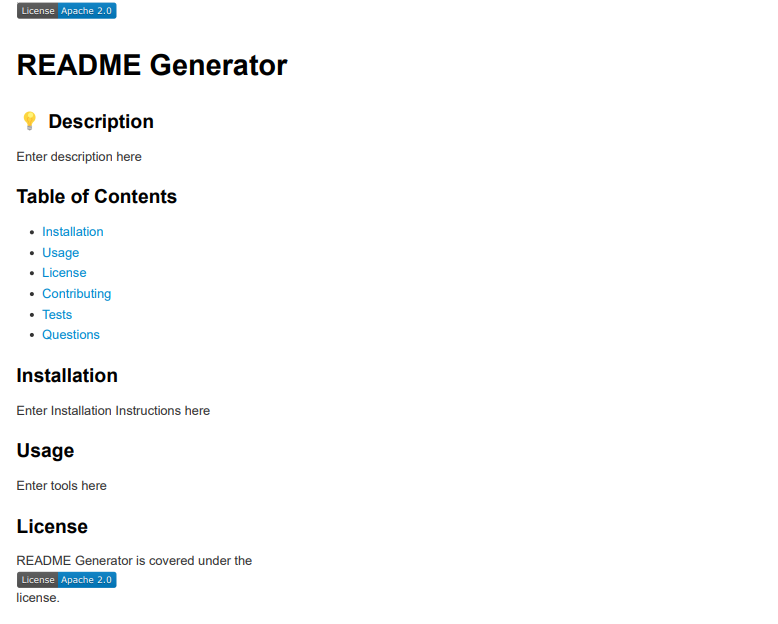

# README Generator

## Description

This creates a README file by using a command-line application to generate one. This allows the project creator to devote more time to working on the project.

## Screenshot

## Video Walkthrough

## Link

<a href=https://shobannah.github.io/ReadMeGenerator/> README Generator